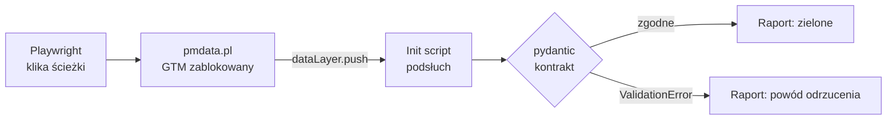

# datalayer-contract-audit

Automatyczny audyt zdarzeń dataLayer pod GA4 na https://pmdata.pl/. Playwright sam przechodzi
ścieżki użytkownika z zablokowanym GTM, a pydantic waliduje każdy push względem kontraktu.

> **Status:** etapy 1–3 z 7 gotowe (szkielet, kontrakt, przechwytywanie). Komendy oznaczone *(plan)* jeszcze nie działają.

## Problem

Tracking psuje się po cichu. Ktoś zmienia nazwę przycisku, refaktoruje komponent albo baner
zgód — strona działa, a w GA4 znika konwersja albo parametr przychodzi pusty. Zwykle wychodzi
to po tygodniach, w raporcie, kiedy danych nie da się już odzyskać.

Ręczny audyt w GTM Preview to kilkanaście minut klikania, które nikt nie powtarza po każdym
deployu. Ten projekt robi to samo automatycznie: przechodzi ścieżki użytkownika jak człowiek,
zbiera każdy push do dataLayer i sprawdza go względem kontraktu spisanego w kodzie.

## Jak to działa



1. **Kontrakt** — tracking plan strony (`events.ts`) przepisany na modele pydantic. Każde
   zdarzenie i każda komenda `gtag()` ma typ, wymagane parametry i reguły biznesowe, np.
   „przed decyzją użytkownika wszystkie zgody są `denied`”.
2. **Podsłuch** — skrypt wstrzyknięty przed kodem strony owija `dataLayer.push` i zapisuje
   kopię każdego pusha w chwili wysłania.
3. **Scenariusze** — testy pytest klikają baner zgód, telefon, LinkedIn, czat i menu mobilne.
4. **Walidacja i raport** — każdy push przechodzi przez kontrakt; wynik ląduje w JSON, z którego
   powstaje raport Markdown i HTML.

## Stack i dlaczego

| Narzędzie | Rola | Dlaczego to, a nie alternatywa |
|---|---|---|
| **Playwright** (Microsoft) | Steruje przeglądarką, wstrzykuje podsłuch, blokuje żądania | `add_init_script` uruchamia się przed kodem strony, a `route` blokuje GTM, zanim żądanie wyjdzie z maszyny. W Selenium to samo wymaga zejścia do CDP/BiDi i więcej kodu. |
| **pydantic v2** | Kontrakt danych | Kontrakt jest kodem, który się uruchamia, a nie dokumentem. Tryb `strict` nie zamienia po cichu `"true"` na `true`, więc łapie błędy implementacji zamiast je maskować. |
| **pytest** + pytest-playwright | Scenariusze, fixture'y | Fixture `page` z osłoną sieci jest domyślny, więc żaden test nie wyśle danych do GA4 przez nieuwagę. |
| **uv** | Python, zależności, lockfile | Jedna komenda instaluje interpreter i środowisko; `uv.lock` daje te same wersje lokalnie i w CI. |
| **ruff + mypy --strict** | Lint i typy | Kontrakt pilnuje typów w danych, mypy pilnuje typów w kodzie, który ten kontrakt egzekwuje. |
| **Makefile** | Jedyny interfejs | `make check` lokalnie i w CI to ta sama komenda — „u mnie działa” znaczy to samo co „CI zielone”. |
| **GitHub Actions** *(etap 7)* | Audyt cykliczny | Cron raz dziennie łapie regresję, zanim zobaczy ją raport w GA4. |

## Decyzje, które warto znać

- **GTM zablokowany, nie wyłączony.** Strona produkcyjna nie ma wersji testowej. Kontrakt
  dotyczy dataLayer, a ten działa bez GTM — więc audyt nie generuje ani jednego hitu w GA4.
- **Komendy gtag to tablice, nie obiekty.** `gtag()` pushuje obiekt `arguments`; bez zamiany
  na tablicę sygnały Consent Mode znikają z audytu. Kontrakt rozpoznaje kształt pusha funkcją,
  a nie polem `event`, którego komendy gtag nie mają.
- **Nawigacje anulowane kliknięciem, nie tylko blokadą sieci.** Zablokowane przejście na
  LinkedIn w tej samej karcie zamienia stronę na stronę błędu i podsłuch ginie razem z nią.
- **Trzy wskaźniki zamiast jednego procentu.** 7 z 8 zdarzeń to 87,5% — dobrze wygląda, nawet
  gdy brakuje akurat zgody marketingowej. Raport pokazuje osobno pokrycie planu, zgodność
  z kontraktem i reguły kolejności.

## Uruchomienie

```bash
make setup          # Python 3.12, .venv, zależności, chromium-headless-shell
make check          # ruff + mypy strict + testy kontraktu i podsłuchu (bez wchodzenia na stronę)
make e2e            # scenariusze na produkcyjnym pmdata.pl, wypisuje przechwycone pushe
make audit          # (plan) scenariusze na pmdata.pl + raport reports/audit-<data>.{json,md,html}
make audit-headed   # (plan) to samo w widocznym oknie, z pauzą między kliknięciami
make help           # pełna lista
```

Klika test, nie człowiek. Każdy scenariusz dostaje świeżą przeglądarkę (pusty `localStorage`),
podsłuchuje `dataLayer.push`, klika według scenariusza i waliduje zebrane pushe.

Podgląd porażki po fakcie: `uv run playwright show-trace test-results/<test>/trace.zip`.
Krok po kroku: `PWDEBUG=1 uv run pytest -m e2e -k <scenariusz>`.

## Bezpieczeństwo produkcji

GTM (`/mackowka/`) jest blokowany w każdym teście, więc nic nie trafia do GA4. Nawigacje do
LinkedIn i `tel:` są abortowane. Czat jest tylko otwierany, nigdy nie wysyła wiadomości.
Scenariusze uruchamiają się sekwencyjnie.

## Etapy

1. ✅ Szkielet: uv, Makefile, ruff, mypy, pytest, Chromium.
2. ✅ Kontrakt: unia pydantic z dyskryminatorem-funkcją (zdarzenia + komendy gtag).
3. ✅ Przechwytywanie: init script owijający `dataLayer.push`.
4. Scenariusze E2E: zgody, telefon, LinkedIn, czat, menu mobilne.
5. Raport: JSON → Markdown + HTML (pokrycie planu, zgodność, reguły).
6. (opcja) Warstwa sieciowa: hity GA4/sGTM przechwycone i abortowane.
7. Drift z `events.ts` + GitHub Actions (cron dzienny).
