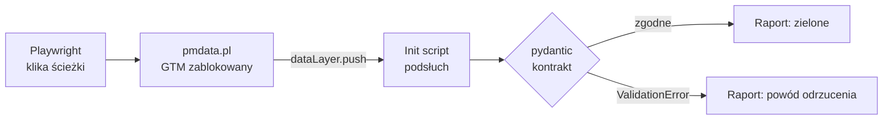

# datalayer-contract-audit

Automatyczny audyt zdarzeń dataLayer pod GA4 na https://pmdata.pl/. Playwright sam przechodzi
ścieżki użytkownika z zablokowanym GTM, a pydantic waliduje każdy push względem kontraktu.

> **Status:** etapy 1–5 i 7 gotowe; etap 6 (warstwa sieciowa) opcjonalny, nierozpoczęty.

## Problem

Tracking psuje się po cichu. Ktoś zmienia nazwę przycisku, refaktoruje komponent albo baner
zgód — strona działa, a w GA4 znika konwersja albo parametr przychodzi pusty. Zwykle wychodzi
to po tygodniach, w raporcie, kiedy danych nie da się już odzyskać.

Ręczny audyt w GTM Preview to kilkanaście minut klikania, które nikt nie powtarza po każdym
deployu. Ten projekt robi to samo automatycznie: przechodzi ścieżki użytkownika jak człowiek,
zbiera każdy push do dataLayer i sprawdza go względem kontraktu spisanego w kodzie.

## Jak to działa



1. **Kontrakt** — tracking plan strony (`events.ts`) przepisany na modele pydantic. Każde
   zdarzenie i każda komenda `gtag()` ma typ, wymagane parametry i reguły biznesowe, np.
   „przed decyzją użytkownika wszystkie zgody są `denied`”.
2. **Podsłuch** — skrypt wstrzyknięty przed kodem strony owija `dataLayer.push` i zapisuje
   kopię każdego pusha w chwili wysłania.
3. **Scenariusze** — testy pytest klikają baner zgód, telefon, LinkedIn, czat i menu mobilne.
4. **Walidacja i raport** — każdy push przechodzi przez kontrakt; wynik ląduje w JSON, z którego
   powstaje raport Markdown i HTML.

## Stack i dlaczego

| Narzędzie | Rola | Dlaczego to, a nie alternatywa |
|---|---|---|
| **Playwright** (Microsoft) | Steruje przeglądarką, wstrzykuje podsłuch, blokuje żądania | `add_init_script` uruchamia się przed kodem strony, a `route` blokuje GTM, zanim żądanie wyjdzie z maszyny. W Selenium to samo wymaga zejścia do CDP/BiDi i więcej kodu. |
| **pydantic v2** | Kontrakt danych | Kontrakt jest kodem, który się uruchamia, a nie dokumentem. Tryb `strict` nie zamienia po cichu `"true"` na `true`, więc łapie błędy implementacji zamiast je maskować. |
| **pytest** + pytest-playwright | Scenariusze, fixture'y | Fixture `page` z osłoną sieci jest domyślny, więc żaden test nie wyśle danych do GA4 przez nieuwagę. |
| **uv** | Python, zależności, lockfile | Jedna komenda instaluje interpreter i środowisko; `uv.lock` daje te same wersje lokalnie i w CI. |
| **ruff + mypy --strict** | Lint i typy | Kontrakt pilnuje typów w danych, mypy pilnuje typów w kodzie, który ten kontrakt egzekwuje. |
| **Makefile** | Jedyny interfejs | `make check` lokalnie i w CI to ta sama komenda — „u mnie działa” znaczy to samo co „CI zielone”. |
| **GitHub Actions** | Audyt cykliczny | Cron codziennie o 8:00 łapie regresję, zanim zobaczy ją raport w GA4. |

## Decyzje, które warto znać

- **GTM zablokowany, nie wyłączony.** Strona produkcyjna nie ma wersji testowej. Kontrakt
  dotyczy dataLayer, a ten działa bez GTM — więc audyt nie generuje ani jednego hitu w GA4.
- **Komendy gtag to tablice, nie obiekty.** `gtag()` pushuje obiekt `arguments`; bez zamiany
  na tablicę sygnały Consent Mode znikają z audytu. Kontrakt rozpoznaje kształt pusha funkcją,
  a nie polem `event`, którego komendy gtag nie mają.
- **Nawigacje anulowane kliknięciem, nie tylko blokadą sieci.** Zablokowane przejście na
  LinkedIn w tej samej karcie zamienia stronę na stronę błędu i podsłuch ginie razem z nią.
- **Trzy wskaźniki zamiast jednego procentu.** 7 z 8 zdarzeń to 87,5% — dobrze wygląda, nawet
  gdy brakuje akurat zgody marketingowej. Raport pokazuje osobno pokrycie planu, zgodność
  z kontraktem i reguły kolejności.

## Architektura plików

```text
datalayer-contract-audit/
├── src/datalayer_audit/        # kod audytu (pakiet Pythona)
│   ├── contract.py             # kontrakt: modele pydantic zdarzeń i komend gtag
│   ├── capture.js              # podsłuch wstrzykiwany do strony przed jej skryptami
│   ├── capture.py              # odczyt podsłuchu z Pythona (DataLayerSpy)
│   ├── guard.py                # osłona sieci: blokada GTM, czatu, LinkedIn, tel:
│   ├── checks.py               # sprawdzenia listy pushy: etykiety, błędy kontraktu
│   ├── report.py               # model raportu i wskaźniki; zapis JSON, Markdown, HTML
│   ├── report.html.j2          # szablon raportu HTML (Jinja2)
│   ├── report.md.j2            # szablon raportu Markdown — lustro HTML, te same teksty
│   └── drift.py                # porównanie kontraktu z events.ts strony
├── tests/
│   ├── conftest.py             # fixture'y (page z osłoną, datalayer) + zapis raportu
│   ├── test_contract.py        # reguły kontraktu: przypadek dobry i zły na każdą
│   ├── test_capture.py         # mechanika podsłuchu i osłony na stronie-atrapie
│   ├── test_report.py          # liczenie wskaźników, escapowanie HTML
│   ├── test_drift.py           # parser events.ts + drift na prawdziwym pliku
│   ├── test_smoke.py           # czy pakiet się importuje i Chromium startuje
│   └── e2e/
│       ├── conftest.py         # symulacja powracającego użytkownika (zgody w localStorage)
│       └── test_scenarios.py   # 11 scenariuszy na produkcyjnym pmdata.pl
├── .github/workflows/ci.yml    # GitHub Actions: quality (każdy push) + audit (cron 8:00)
├── Makefile                    # jedyny interfejs: setup, check, audit, audit-open…
├── pyproject.toml              # zależności i konfiguracja ruff, mypy, pytest, coverage
├── uv.lock                     # zamrożone wersje bibliotek — te same lokalnie i w CI
├── CLAUDE.md                   # kontekst projektu dla Claude Code
└── reports/, test-results/     # wyniki audytów i trace (lokalne, poza gitem)
```

Przepływ jednego scenariusza przez pliki:

1. `tests/conftest.py` tworzy stronę z osłoną (`guard.py`) i podsłuchem (`capture.js` przez
   `capture.py`).
2. `tests/e2e/test_scenarios.py` wchodzi na pmdata.pl i klika.
3. `checks.py` porównuje sekwencję pushy z oczekiwaną i waliduje każdy push w `contract.py`.
4. Po wszystkich scenariuszach `tests/conftest.py` przekazuje wyniki do `report.py`, który
   liczy wskaźniki i zapisuje raport przez `report.html.j2` i `report.md.j2`.

Kod nie wie nic o konkretnych scenariuszach, a scenariusze nie wiedzą, jak działa raport.
Zmiana na stronie wymaga zwykle zmiany tylko w jednym miejscu: selektor w `test_scenarios.py`
albo model w `contract.py`.

## Ręczny audyt krok po kroku

Wszystkie komendy uruchamiasz w terminalu **w katalogu projektu** — `make` szuka pliku
`Makefile` w bieżącym katalogu. Każdy blok poniżej da się skopiować i wkleić w całości.

### 1. Wejdź do katalogu projektu

```bash
cd ~/Documents/dev/datalayer-contract-audit
```

### 2. Przygotuj środowisko (pierwszy raz albo po zmianie zależności)

```bash
make setup
```

Instaluje Pythona 3.12, tworzy `.venv`, pobiera biblioteki i Chromium bez okna. Trwa ok. minuty.

### 3. Sprawdź, czy kod jest sprawny (bez wchodzenia na stronę)

```bash
make check
```

Lint, typy i testy kontraktu, podsłuchu, raportu oraz driftu względem `../personal-page`.
Zielony wynik kończy się linią `... passed`.

### 4. Uruchom audyt i otwórz raport w Chrome

```bash
make audit-open
```

Przechodzi 11 scenariuszy na https://pmdata.pl/ (ok. 10 s, GTM zablokowany), zapisuje
raport w `reports/` i otwiera go w Chrome. Raport otwiera się także wtedy, gdy audyt padnie.

Pliki raportu — jeden przebieg, trzy formaty:

| Plik | Dla kogo |
|---|---|
| `reports/audit-<data>-<godzina>.html` | dla człowieka — kafelki, tabela zdarzeń, scenariusze |
| `reports/audit-<data>-<godzina>.md` | ta sama treść co HTML; trafia do podsumowania joba w GitHub Actions (tam działa tylko Markdown), da się wkleić do issue |
| `reports/audit-<data>-<godzina>.json` | dla maszyny — źródło, z którego powstają dwa pozostałe |

### Pozostałe komendy

```bash
make open-report    # otwiera najnowszy raport bez uruchamiania audytu
make audit          # audyt + raport, bez otwierania przeglądarki (tak działa CI)
make e2e            # same scenariusze, wypisuje przechwycone pushe w terminalu, bez raportu
make e2e-headed     # scenariusze w widocznym oknie Chromium, pauza 500 ms między kliknięciami
make help           # pełna lista komend
```

Jeden scenariusz zamiast wszystkich (`-k` filtruje po nazwie testu):

```bash
uv run pytest -m e2e -k chat -s
```

Krok po kroku, z podświetleniem elementu przed każdym kliknięciem (Playwright Inspector):

```bash
PWDEBUG=1 uv run pytest -m e2e -k chat
```

Podgląd porażki po fakcie — nagranie z zrzutami ekranu, DOM-em i siecią przy każdej akcji:

```bash
uv run playwright show-trace test-results/*/trace.zip
```

## Automatyczny audyt w GitHub Actions

GitHub Actions to maszyny wirtualne GitHuba: przy każdym uruchomieniu powstaje świeży Ubuntu,
wykonuje kroki z `.github/workflows/ci.yml` i znika. Workflow `CI` ma dwa joby:

| Job | Kiedy | Co robi |
|---|---|---|
| `quality` | każdy push i PR, codziennie o 8:00 | `make check` + drift kontraktu względem `events.ts` |
| `audit` | codziennie o 8:00, ręcznie | `make audit` na produkcji, raport w podsumowaniu i jako artefakt |

- **Godzina:** cron w GitHubie liczy wyłącznie w UTC. `0 6 * * *` to 8:00 czasu letniego
  i 7:00 zimowego. Start o pełnej godzinie bywa opóźniony o kilkanaście minut.
- **Ręczne uruchomienie:** zakładka Actions → CI → Run workflow, albo z terminala:
  `gh workflow run CI`.
- **Wynik:** zakładka Actions → przebieg → podsumowanie z tabelą raportu; raport HTML, MD
  i JSON w sekcji Artifacts (przechowywane 30 dni). Porażkę zaplanowanego przebiegu GitHub zgłasza
  mailem.
- **Drift:** `events.ts` leży w prywatnym repo strony, więc CI pobiera go tokenem
  `PERSONAL_PAGE_TOKEN` (fine-grained PAT: tylko `personal-page`, tylko Contents: read).
  Nowe zdarzenie na stronie bez modelu w kontrakcie = czerwony build.
- **Koszt:** repo jest publiczne, więc minuty GitHub Actions są darmowe bez limitu.
  Przebieg trwa ok. 5–6 minut.
- **Artefakty są publiczne:** pobierze je każdy zalogowany użytkownik GitHuba. Dlatego
  workflow wgrywa tylko `reports/`, bez trace Playwrighta — trace zawiera zrzuty ekranu
  i pełny DOM, w tym numer telefonu odkryty w scenariuszu. Trace oglądasz lokalnie.
- **Cron w publicznym repo** GitHub wyłącza po 60 dniach bez aktywności (wysyła maila
  wcześniej) — wystarczy commit albo „Enable workflow” w zakładce Actions.

## Licencja

MIT — zobacz [LICENSE](LICENSE).

## Bezpieczeństwo produkcji

GTM (`/mackowka/`) i endpoint czatu są blokowane na poziomie sieci: żądanie kończy się błędem,
zanim opuści przeglądarkę, więc nic nie trafia do GA4. Kliknięcia w LinkedIn i `tel:` są
anulowane: strona wysyła zdarzenie do dataLayer, ale przejście nie następuje. Czat jest tylko
otwierany, nigdy nie wysyła wiadomości.
Scenariusze uruchamiają się sekwencyjnie.

## Etapy

1. ✅ Szkielet: uv, Makefile, ruff, mypy, pytest, Chromium.
2. ✅ Kontrakt: unia pydantic z dyskryminatorem-funkcją (zdarzenia + komendy gtag).
3. ✅ Przechwytywanie: init script owijający `dataLayer.push`.
4. ✅ Scenariusze E2E: zgody, telefon, LinkedIn, czat, menu mobilne.
5. ✅ Raport: JSON → Markdown + HTML (pokrycie planu, zgodność, reguły).
6. (opcja) Warstwa sieciowa: hity GA4/sGTM przechwycone i abortowane.
7. ✅ Drift z `events.ts` + GitHub Actions (cron dzienny, raport jako artefakt i w podsumowaniu joba).
