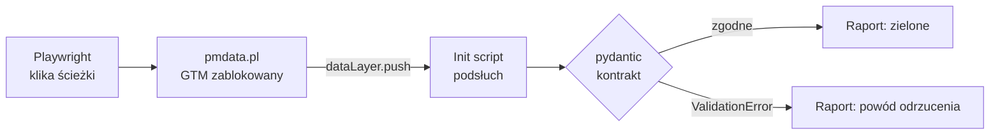

# datalayer-contract-audit

Automatyczny audyt zdarzeń dataLayer pod GA4 na https://pmdata.pl/. Playwright sam przechodzi
ścieżki użytkownika z zablokowanym GTM, a pydantic waliduje każdy push względem kontraktu.

> **Status:** gotowy — 12 scenariuszy, codzienny audyt w GitHub Actions.

## Problem

Tracking psuje się po cichu. Ktoś zmienia nazwę przycisku, refaktoruje komponent albo baner
zgód — strona działa, a w GA4 znika konwersja albo parametr przychodzi pusty. Zwykle wychodzi
to po tygodniach, w raporcie, kiedy danych nie da się już odzyskać.

Ręczny audyt w GTM Preview to kilkanaście minut klikania, które nikt nie powtarza po każdym
deployu. Ten projekt robi to samo automatycznie: przechodzi ścieżki użytkownika jak człowiek,
zbiera każdy push do dataLayer i sprawdza go względem kontraktu spisanego w kodzie.

## Jak to działa



1. **Kontrakt** — tracking plan strony (`events.ts`) przepisany na modele pydantic. Każde
   zdarzenie i każda komenda `gtag()` ma typ, wymagane parametry i reguły biznesowe, np.
   „przed decyzją użytkownika wszystkie zgody są `denied`”.
2. **Podsłuch** — skrypt wstrzyknięty przed kodem strony owija `dataLayer.push` i zapisuje
   kopię każdego pusha w chwili wysłania.
3. **Scenariusze** — testy klikają baner zgód, telefon, LinkedIn, czat, menu mobilne
   i stopkę artykułu. Każdy scenariusz startuje w świeżej przeglądarce (pusty `localStorage`).
4. **Walidacja i raport** — każdy push przechodzi przez kontrakt; wynik ląduje w JSON, z którego
   powstaje raport HTML i Markdown.

## Kiedy audyt się uruchamia

Audyt uruchamia się w dwóch miejscach: **na twoim Macu** (ręcznie) i **w GitHub Actions**
(w chmurze). To dwa niezależne przebiegi na dwóch różnych komputerach.

| Sytuacja | Uruchamia się? | Gdzie | Co dokładnie |
|---|---|---|---|
| Wpisujesz `make audit-open` | tak | Mac | scenariusze + raport w `reports/`, otwiera Chrome |
| Codziennie o 8:00 (7:00 zimą) | tak, samo | GitHub | job `quality` + job `audit` |
| Klikasz Run workflow w Actions | tak | GitHub | job `quality` + job `audit` |
| Push do **tego** repo | tak, samo | GitHub | tylko job `quality` (testy bez wchodzenia na stronę) |
| Zmiana albo deploy **personal-page** | **nie** | — | GitHub nie wie o deployu strony — złapie to najbliższy poranny audyt |

Po deployu strony, gdy nie chcesz czekać do rana: Actions → CI → Run workflow
(albo `gh workflow run CI --repo pmackowka/datalayer-contract-audit`).

## Gdzie oglądasz wyniki

| | Na Macu | W GitHub Actions |
|---|---|---|
| Skąd | `make audit-open` | poranny cron albo Run workflow |
| Raport | `reports/audit-<data>-<godzina>.html` otwiera się w Chrome | podsumowanie joba `audit` (Markdown) + artefakt do pobrania (HTML, MD, JSON) |
| Trace przy porażce | `test-results/` — nagranie każdej akcji | brak (repo publiczne, trace zawiera numer telefonu) |
| Historia | wszystkie raporty zostają w `reports/` | przebiegi w zakładce Actions, artefakty 30 dni |

**Raport z GitHuba nie trafia na Maca, a raport z Maca nie trafia na GitHuba.** Dlatego czasy
w milisekundach i godzina się różnią: to dwa różne przebiegi, na innym sprzęcie, w innej sieci.
Nazwa pliku w `reports/` zawiera godzinę w UTC (np. `audit-2026-10-02-053412` to 07:34 czasu
polskiego latem); nagłówek raportu pokazuje oba czasy.

## Jak czytać zakładkę Actions

1. **Lista przebiegów** (Actions → CI po lewej). Każdy wiersz to jedno uruchomienie workflow.
   Tytułem jest treść commita, który je uruchomił (push), albo `CI` (cron, Run workflow).
   Pod tytułem: rodzaj zdarzenia — `push`, `schedule` (cron) albo `workflow_dispatch` (ręcznie).
2. **Wnętrze przebiegu.** Na środku graf dwóch jobów, po lewej ich lista:
   - `quality` — lint, typy, testy i drift względem `events.ts`. Nie dotyka strony.
   - `audit` — scenariusze na pmdata.pl. Przy `push` jest szary (pominięty) — celowo, bo
     zmiana kodu audytu nie jest powodem, żeby odwiedzać produkcję.
3. **Raport.** Na stronie przebiegu, pod grafem jobów, jest sekcja **audit summary** —
   to raport Markdown (ten sam tekst co plik `.md`).
4. **Pełny HTML.** Na dole strony przebiegu: **Artifacts** → `audit-<numer>` → pobierz ZIP,
   rozpakuj, otwórz `.html`.
5. **Porażka.** Czerwony przebieg z crona GitHub zgłasza mailem. W raporcie nieudany
   scenariusz jest rozwinięty, z komunikatem błędu.

Plik, który opisuje to wszystko, to `.github/workflows/ci.yml` — w nim są wyzwalacze (`on:`),
godzina crona i kroki obu jobów.

## Ręczny audyt krok po kroku

Wszystkie komendy uruchamiasz w terminalu **w katalogu projektu** — `make` szuka pliku
`Makefile` w bieżącym katalogu. Każdy blok poniżej da się skopiować i wkleić w całości.

### 1. Wejdź do katalogu projektu

```bash
cd ~/Documents/dev/datalayer-contract-audit
```

### 2. Przygotuj środowisko (pierwszy raz albo po zmianie zależności)

```bash
make setup
cp .env.example .env
```

`make setup` instaluje Pythona 3.12, tworzy `.venv`, pobiera biblioteki i Chromium bez okna
(ok. minuty). W `.env` wpisz `GTM_LOADER_GLOB` — wzorzec ścieżki first-party loadera GTM,
który testy blokują. Plik jest poza gitem: repo jest publiczne, a opisana wprost ścieżka
loadera to gotowy wpis dla list blokujących reklamy. Bez tej wartości scenariusze nie ruszą.

### 3. Sprawdź, czy kod jest sprawny (bez wchodzenia na stronę)

```bash
make check
```

Lint, typy i testy kontraktu, podsłuchu, raportu oraz driftu względem `../personal-page`.
Zielony wynik kończy się linią `... passed`.

### 4. Uruchom audyt i otwórz raport w Chrome

```bash
make audit-open
```

Przechodzi 12 scenariuszy na https://pmdata.pl/ (ok. 10 s, GTM zablokowany), zapisuje
raport w `reports/` i otwiera go w Chrome. Raport otwiera się także wtedy, gdy audyt padnie.

### Pozostałe komendy

```bash
make open-report    # otwiera najnowszy raport bez uruchamiania audytu
make audit          # audyt + raport, bez otwierania przeglądarki (tak działa CI)
make e2e            # same scenariusze, wypisuje przechwycone pushe w terminalu, bez raportu
make e2e-headed     # scenariusze w widocznym oknie Chromium, pauza 500 ms między kliknięciami
make help           # pełna lista komend
```

Jeden scenariusz zamiast wszystkich (`-k` filtruje po nazwie testu):

```bash
uv run pytest -m e2e -k chat -s
```

Krok po kroku, z podświetleniem elementu przed każdym kliknięciem (Playwright Inspector):

```bash
PWDEBUG=1 uv run pytest -m e2e -k chat
```

Podgląd porażki po fakcie — nagranie ze zrzutami ekranu, DOM-em i siecią przy każdej akcji:

```bash
uv run playwright show-trace test-results/*/trace.zip
```

## Jak czytać raport

Raport HTML i Markdown mają tę samą treść w tej samej kolejności.

1. **Werdykt** — „Zgodny z planem” tylko wtedy, gdy wszystkie trzy wskaźniki mają 100%.
2. **Wskaźniki** — każdy z liczbami, nie tylko procentem:

   | Wskaźnik | Pytanie |
   |---|---|
   | Pokrycie planu | Czy każde z 8 zdarzeń z `events.ts` odpaliło poprawnie choć raz? |
   | Zgodność z kontraktem | Czy każdy push (także komendy `gtag`) przeszedł walidację? |
   | Scenariusze zielone | Czy w każdym scenariuszu kolejność i parametry były takie jak w planie? |

3. **Zdarzenia z planu** — dla każdego zdarzenia: ile razy odpaliło, ile razy poprawnie,
   status i **w których scenariuszach wystąpiło**. To obserwacja, nie opis scenariusza:
   `cookie_consent_marketing` występuje wszędzie tam, gdzie zgoda marketingowa była udzielona
   (akceptacja wszystkich i „tylko marketing”), a nie tylko w jednym miejscu.
4. **Scenariusze** — zwinięte; nieudane rozwijają się same. W środku każdy push z czasem
   w milisekundach od wczytania strony, a na dole zablokowane żądania: zwykle jedno — loader
   GTM. Strona dalej pushuje do dataLayer, ale bez GTM nikt nie wysyła tego do GA4.

## Drift: kontrakt kontra strona

`make check` porównuje kontrakt z `src/data/events.ts` repo strony — nazwy zdarzeń i ich
parametry. Nowe zdarzenie na stronie bez modelu w kontrakcie = czerwony build. Lokalnie test
czyta `../personal-page`; w GitHub Actions pobiera plik z prywatnego repo tokenem
`PERSONAL_PAGE_TOKEN` (fine-grained PAT: tylko `personal-page`, tylko Contents: read,
ważny do 01.10.2027 — po wygaśnięciu job `quality` zrobi się czerwony).

## Bezpieczeństwo produkcji

Loader GTM i endpoint czatu są blokowane na poziomie sieci: żądanie kończy się błędem,
zanim opuści przeglądarkę, więc nic nie trafia do GA4. Kliknięcia w LinkedIn i `tel:` są
anulowane: strona wysyła zdarzenie do dataLayer, ale przejście nie następuje. Czat jest tylko
otwierany, nigdy nie wysyła wiadomości. Scenariusze uruchamiają się sekwencyjnie.

## Koszty i utrzymanie

- **GitHub Actions:** repo jest publiczne, więc minuty są darmowe bez limitu. Przebieg trwa
  ok. 1–2 minut.
- **Godzina crona:** GitHub liczy cron wyłącznie w UTC. `0 6 * * *` to 8:00 latem i 7:00
  zimą. Start o pełnej godzinie bywa opóźniony o kilkanaście minut.
- **Cron w publicznym repo** GitHub wyłącza po 60 dniach bez aktywności (wysyła maila
  wcześniej) — wystarczy commit albo „Enable workflow” w zakładce Actions.
- **Sekrety CI:** `PERSONAL_PAGE_TOKEN` (drift) i `GTM_LOADER_GLOB` (ścieżka loadera dla
  joba `audit`). Raport w Actions pokazuje zablokowane żądania jako kategorię z domeną,
  np. „loader GTM (pmdata.pl)”, bez ścieżki.
- **Runner** jest przypięty do `ubuntu-24.04`, więc zmiana `ubuntu-latest` po stronie GitHuba
  niczego nie zepsuje bez twojej decyzji.

## Stack i dlaczego

| Narzędzie | Rola | Dlaczego to, a nie alternatywa |
|---|---|---|
| **Playwright** (Microsoft) | Steruje przeglądarką, wstrzykuje podsłuch, blokuje żądania | `add_init_script` uruchamia się przed kodem strony, a `route` blokuje GTM, zanim żądanie wyjdzie z maszyny. W Selenium to samo wymaga zejścia do CDP/BiDi i więcej kodu. |
| **pydantic v2** | Kontrakt danych | Kontrakt jest kodem, który się uruchamia, a nie dokumentem. Tryb `strict` nie zamienia po cichu `"true"` na `true`, więc łapie błędy implementacji zamiast je maskować. |
| **pytest** + pytest-playwright | Scenariusze, fixture'y | Fixture `page` z osłoną sieci jest domyślny, więc żaden test nie wyśle danych do GA4 przez nieuwagę. |
| **Jinja2** | Szablony raportu | Autoescape: tekst ze strony (np. `link_text`) nie wykona się jako kod w raporcie HTML. |
| **uv** | Python, zależności, lockfile | Jedna komenda instaluje interpreter i środowisko; `uv.lock` daje te same wersje lokalnie i w CI. |
| **ruff + mypy --strict** | Lint i typy | Kontrakt pilnuje typów w danych, mypy pilnuje typów w kodzie, który ten kontrakt egzekwuje. |
| **Makefile** | Jedyny interfejs | `make check` lokalnie i w CI to ta sama komenda — „u mnie działa” znaczy to samo co „CI zielone”. |
| **GitHub Actions** | Audyt cykliczny | Cron codziennie rano łapie regresję, zanim zobaczy ją raport w GA4. |

## Decyzje, które warto znać

- **GTM zablokowany, nie wyłączony.** Strona produkcyjna nie ma wersji testowej. Kontrakt
  dotyczy dataLayer, a ten działa bez GTM — więc audyt nie generuje ani jednego hitu w GA4.
  Hity GA4 (warstwa sieciowa) są świadomie poza zakresem.
- **Komendy gtag to tablice, nie obiekty.** `gtag()` pushuje obiekt `arguments`; bez zamiany
  na tablicę sygnały Consent Mode znikają z audytu. Kontrakt rozpoznaje kształt pusha funkcją,
  a nie polem `event`, którego komendy gtag nie mają.
- **Nawigacje anulowane kliknięciem, nie tylko blokadą sieci.** Zablokowane przejście na
  LinkedIn w tej samej karcie zamienia stronę na stronę błędu i podsłuch ginie razem z nią.
- **Trzy wskaźniki zamiast jednego procentu.** 7 z 8 zdarzeń to 87,5% — dobrze wygląda, nawet
  gdy brakuje akurat zgody marketingowej.
- **Jeden model raportu, dwa widoki.** Liczby liczy wyłącznie `AuditReport`; szablony HTML
  i Markdown tylko formatują, a test pilnuje, że mają te same sekcje i teksty.

## Architektura plików

```text
datalayer-contract-audit/
├── src/datalayer_audit/        # kod audytu (pakiet Pythona)
│   ├── contract.py             # kontrakt: modele pydantic zdarzeń i komend gtag
│   ├── capture.js              # podsłuch wstrzykiwany do strony przed jej skryptami
│   ├── capture.py              # odczyt podsłuchu z Pythona (DataLayerSpy)
│   ├── guard.py                # osłona sieci: blokada GTM, czatu, LinkedIn, tel:
│   ├── checks.py               # sprawdzenia listy pushy: etykiety, błędy kontraktu
│   ├── report.py               # model raportu i wskaźniki; zapis JSON, Markdown, HTML
│   ├── report.html.j2          # szablon raportu HTML (Jinja2)
│   ├── report.md.j2            # szablon raportu Markdown — lustro HTML, te same teksty
│   └── drift.py                # porównanie kontraktu z events.ts strony
├── tests/
│   ├── conftest.py             # fixture'y (page z osłoną, datalayer) + zapis raportu
│   ├── test_contract.py        # reguły kontraktu: przypadek dobry i zły na każdą
│   ├── test_capture.py         # mechanika podsłuchu i osłony na stronie-atrapie
│   ├── test_report.py          # liczenie wskaźników, escapowanie HTML, symetria widoków
│   ├── test_drift.py           # parser events.ts + drift na prawdziwym pliku
│   ├── test_smoke.py           # czy pakiet się importuje i Chromium startuje
│   └── e2e/
│       ├── conftest.py         # symulacja powracającego użytkownika (zgody w localStorage)
│       └── test_scenarios.py   # 12 scenariuszy na produkcyjnym pmdata.pl
├── .github/workflows/ci.yml    # GitHub Actions: quality (każdy push) + audit (cron rano)
├── Makefile                    # jedyny interfejs: setup, check, audit, audit-open…
├── pyproject.toml              # zależności i konfiguracja ruff, mypy, pytest, coverage
├── uv.lock                     # zamrożone wersje bibliotek — te same lokalnie i w CI
├── CLAUDE.md                   # kontekst projektu dla Claude Code
└── reports/, test-results/     # wyniki audytów i trace (lokalne, poza gitem)
```

Przepływ jednego scenariusza przez pliki:

1. `tests/conftest.py` tworzy stronę z osłoną (`guard.py`) i podsłuchem (`capture.js` przez
   `capture.py`).
2. `tests/e2e/test_scenarios.py` wchodzi na pmdata.pl i klika.
3. `checks.py` porównuje sekwencję pushy z oczekiwaną i waliduje każdy push w `contract.py`.
4. Po wszystkich scenariuszach `tests/conftest.py` przekazuje wyniki do `report.py`, który
   liczy wskaźniki i zapisuje raport przez `report.html.j2` i `report.md.j2`.

Zmiana na stronie wymaga zwykle zmiany tylko w jednym miejscu: selektor w `test_scenarios.py`
albo model w `contract.py`.

## Licencja

MIT — zobacz [LICENSE](LICENSE).
